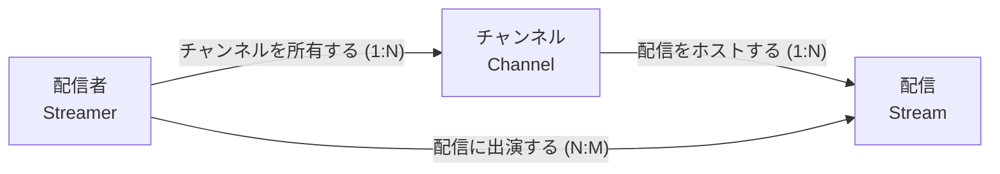
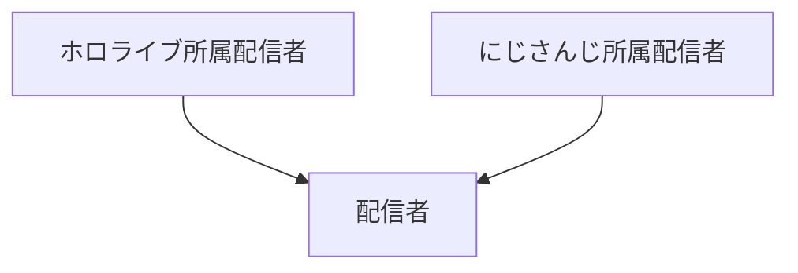

# オントロジー可視化

metamesh は **組み込みの可視化コマンドを持たない**。代わりに、この Skill が
ユーザーの自然言語要求を **SPARQL CONSTRUCT** に変換 → triples を受け取り →
**Mermaid** や Markdown 表として **チャット内で即時レンダリング** する。

「可視化機能はオプショナルでいい、SPARQL があれば LLM が必要な形に都度変換
できる」という metamesh の設計思想 (PROJECT_CONTEXT.md §2.2) の具体化。

## 前提条件

- `mcp__metamesh__query_concept` が利用可能 (CONSTRUCT / SELECT 両モード)
- ユーザーのチャット環境が Mermaid をレンダリングできる
  (Claude Desktop / Code, Zenn, GitHub Markdown, Notion など主要環境は OK)

## 可視化モードの選び方

ユーザーの要求から、4 つのモードのどれが適切かを判断する：

| モード | トリガー例 | SPARQL の形 |
|---|---|---|
| **A. 全体俯瞰** | "オントロジー全体を図で見せて" | concept-relationship の全 triples |
| **B. フォーカス近傍** | "Streamer 周辺だけ", "Stream に関係する全部" | 1 概念を起点に 1〜2 hops |
| **C. フィルタ抽出** | "N:M の関係性だけ", "全 Hub と business_key" | 条件付き SELECT or CONSTRUCT |
| **D. 階層 / 系統** | "concept の broader/narrower 階層" | skos:broader 推移閉包 |

**判断のコツ:**
- 概念名が出たら → モード B
- 「全体」「全部」「全 X」 → A
- 「だけ」「のみ」「と〜の」 → C
- 「上位」「下位」「親」「子」 → D

## SPARQL レシピ

### モード A: 全体俯瞰

```sparql
PREFIX skos: <http://www.w3.org/2004/02/skos/core#>
PREFIX rdfs: <http://www.w3.org/2000/01/rdf-schema#>
PREFIX owl: <http://www.w3.org/2002/07/owl#>
PREFIX dv: <https://metamesh.dev/ext/dv/>

CONSTRUCT {
    ?rel rdfs:domain ?domain ;
         rdfs:range ?range ;
         skos:prefLabel ?relLabel ;
         dv:cardinality ?card .
    ?domain skos:prefLabel ?domainLabel .
    ?range skos:prefLabel ?rangeLabel .
}
WHERE {
    ?rel a owl:ObjectProperty ;
         rdfs:domain ?domain ;
         rdfs:range ?range ;
         skos:prefLabel ?relLabel .
    OPTIONAL { ?rel dv:cardinality ?card }
    OPTIONAL { ?domain skos:prefLabel ?domainLabel . FILTER(LANG(?domainLabel) = "ja") }
    OPTIONAL { ?range skos:prefLabel ?rangeLabel . FILTER(LANG(?rangeLabel) = "ja") }
    FILTER(LANG(?relLabel) = "ja")
}
```

### モード B: 1 概念にフォーカス (1 hop)

`<https://metamesh.dev/ontology/Streamer>` の部分を対象 concept に置換：

```sparql
PREFIX skos: <http://www.w3.org/2004/02/skos/core#>
PREFIX rdfs: <http://www.w3.org/2000/01/rdf-schema#>
PREFIX owl: <http://www.w3.org/2002/07/owl#>
PREFIX dv: <https://metamesh.dev/ext/dv/>

CONSTRUCT {
    ?rel rdfs:domain ?domain ;
         rdfs:range ?range ;
         skos:prefLabel ?relLabel ;
         dv:cardinality ?card .
}
WHERE {
    ?rel a owl:ObjectProperty ;
         rdfs:domain ?domain ;
         rdfs:range ?range ;
         skos:prefLabel ?relLabel .
    OPTIONAL { ?rel dv:cardinality ?card }
    FILTER(LANG(?relLabel) = "ja")
    FILTER(?domain = <https://metamesh.dev/ontology/Streamer> ||
           ?range = <https://metamesh.dev/ontology/Streamer>)
}
```

### モード C: フィルタ抽出例

**「N:M 関係性だけ」:**

```sparql
PREFIX dv: <https://metamesh.dev/ext/dv/>
PREFIX rdfs: <http://www.w3.org/2000/01/rdf-schema#>
PREFIX skos: <http://www.w3.org/2004/02/skos/core#>

CONSTRUCT {
    ?rel rdfs:domain ?domain ;
         rdfs:range ?range ;
         skos:prefLabel ?label .
}
WHERE {
    ?rel dv:cardinality "N:M" ;
         rdfs:domain ?domain ;
         rdfs:range ?range ;
         skos:prefLabel ?label .
    FILTER(LANG(?label) = "ja")
}
```

**「全 Hub と business_key」 (これは表向き、SELECT を使う):**

```sparql
PREFIX dv: <https://metamesh.dev/ext/dv/>
PREFIX skos: <http://www.w3.org/2004/02/skos/core#>

SELECT ?label ?hub ?bk WHERE {
    ?c dv:hub ?hub .
    OPTIONAL { ?c dv:business_key ?bk }
    OPTIONAL { ?c skos:prefLabel ?label . FILTER(LANG(?label) = "ja") }
}
ORDER BY ?hub
```

### モード D: 階層 (broader/narrower)

```sparql
PREFIX skos: <http://www.w3.org/2004/02/skos/core#>

CONSTRUCT {
    ?child skos:broader ?parent ;
           skos:prefLabel ?childLabel .
    ?parent skos:prefLabel ?parentLabel .
}
WHERE {
    ?child skos:broader+ ?parent .
    OPTIONAL { ?child skos:prefLabel ?childLabel . FILTER(LANG(?childLabel) = "ja") }
    OPTIONAL { ?parent skos:prefLabel ?parentLabel . FILTER(LANG(?parentLabel) = "ja") }
}
```

## Mermaid 変換ルール

`mcp__metamesh__query_concept(sparql=...)` の戻り値 (CONSTRUCT モード) は
`{type: "CONSTRUCT", triples: [[s, p, o], ...]}`。これを以下のロジックで
Mermaid に変換：

1. **concept_id 抽出**: 各 IRI の最後のセグメント (`STRAFTER(STR(?x), "/ontology/")` 相当) を node ID として使う
2. **node 定義**: `concept_id["日本語ラベル<br/>concept_id"]` 形式
   (label が無いやつは concept_id だけ)
3. **edge 定義**: `domain -->|"関係名 (cardinality)"| range`
4. **graph 方向**: `LR` (左→右) を default。階層モード (D) は `TB` (上→下)
5. **node ID の sanitize**: Mermaid は記号に弱いので、必要なら `_` に置換

### 出力テンプレート (モード A/B/C)

````markdown

````

### 出力テンプレート (モード D 階層)

````markdown

````

## 可視化後の流れ

1. **Mermaid を chat に直接貼る** (ファイル出力しない)。ユーザーは即座に図として見られる
2. **要点をテキストでも添える**: 「N=12 nodes, M=18 edges、最も繋がってるのは Streamer (4 edges)」のような統計
3. **次の一手を提案**: 「特定概念にフォーカスして見たい？」「DDL に変換する `dv-implementation-design` を起動する？」など、自然な続き

## 例

### 例 1: 全体俯瞰

```text
User: 「オントロジー全体を Mermaid で見せて」

Claude:
  → モード A 判定
  → mcp__metamesh__query_concept(sparql=<モード A 全体俯瞰の SPARQL>)
  → triples を受け取って Mermaid 化
  → チャットに ```mermaid ブロックを貼る
  → "7 concepts, 6 relationships。Streamer が最ハブ (4 connections)" と添える
```

### 例 2: フォーカス

```text
User: 「Stream の周辺だけ見せて」

Claude:
  → モード B、対象 = Stream
  → SPARQL の FILTER 部分を <https://metamesh.dev/ontology/Stream> に置換
  → mcp__metamesh__query_concept(...)
  → Mermaid 化 (Stream を中心に半径 1 の subgraph)
```

### 例 3: フィルタ + 表

```text
User: 「N:M の関係性だけ表で」

Claude:
  → モード C、表形式 → SELECT でいい
  → SPARQL: SELECT ?rel ?domain ?range WHERE { ?rel dv:cardinality "N:M" ... }
  → 結果を Markdown 表として直接貼る
```

## アンチパターン

- ❌ **Mermaid を毎回ファイルに書き出す** — チャットに直貼りで十分。ファイル
   出力したいなら `generate_dbt_yaml` のような generator ツールがあるべき
   (= 別の Skill / 別のツール)
- ❌ **SPARQL を毎回ゼロから書き起こす** — このドキュメントのレシピをまず
   試して、足りないところだけ拡張する
- ❌ **node ID にスペース / 日本語 / 特殊文字を入れる** — Mermaid のパーサが
   壊れる。concept_id (PascalCase 英数字) を ID として使い、ラベル部分に
   日本語を置く
- ❌ **Cardinality を edge label に詰めない** — `1:N` / `N:M` は edge の
   重要な属性なので必ずラベルに含める
- ❌ **大きすぎる subgraph をいきなり描画する** — 50 ノード超えると Mermaid
   が読めなくなる。先に SELECT で件数確認 → 大きすぎたらフィルタ提案
- ❌ **SKOS の altLabel / definition を全部 node に詰める** — 図がノイズ
   まみれになる。ラベル + (オプションで) 短い identifier だけで十分
